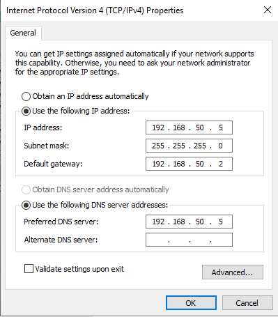

# Task 1 - Deploy a Windows Server 2019 virtual machine configured as Domain Controller with the following parameters:
* Hostname: DC01
* Static IP Address: **192.168.50.5**
* DNS Server: **192.168.50.5 (Self)**
* **Active Directory Domain Services installed and configured**

# Steps performed
1. Created a new Virtual Machine in VMware Workstation Pro
  * Default settings used
  * Windows Server 2019 ISO image used

2. Installed Windows Server 2019 to the Virtual Machine
  * Windows Server 2019 Standard Evaluation (Desktop Experience) selected for GUI

3. Hostname changed to "DC01"
  * Server restarted in order for changes to take effect

4. Static IP addresses configured as follows:
  * IP Address: 192.168.50.5
  * Subnet Mask: 255.255.255.0
  * DNS Server: 192.168.50.5
  * Additionally, the default gateway has been configured with: 192.168.50.2 - The Virtual Default Gateway address

5. Active Directory Domain Services installed via Server Manager
  * DNS Server was included in this installation to be used for Active Directory Name Resoulution

6. Promoted server to Domain Controller
7.   * New forest created with Root domain name: **lab.local**
     * Strong DSRM password set
     *  Netbios Name - **Lab**
     *  Server automatically restarted after installation for changes to take effect

# Problems encountered:
* No issues encountered during this task

# Verification:
* Ipconfig shows correct addressing scheme
* Hostname shows as **DC01**
* Active Directory Users and Computers installed and runs

